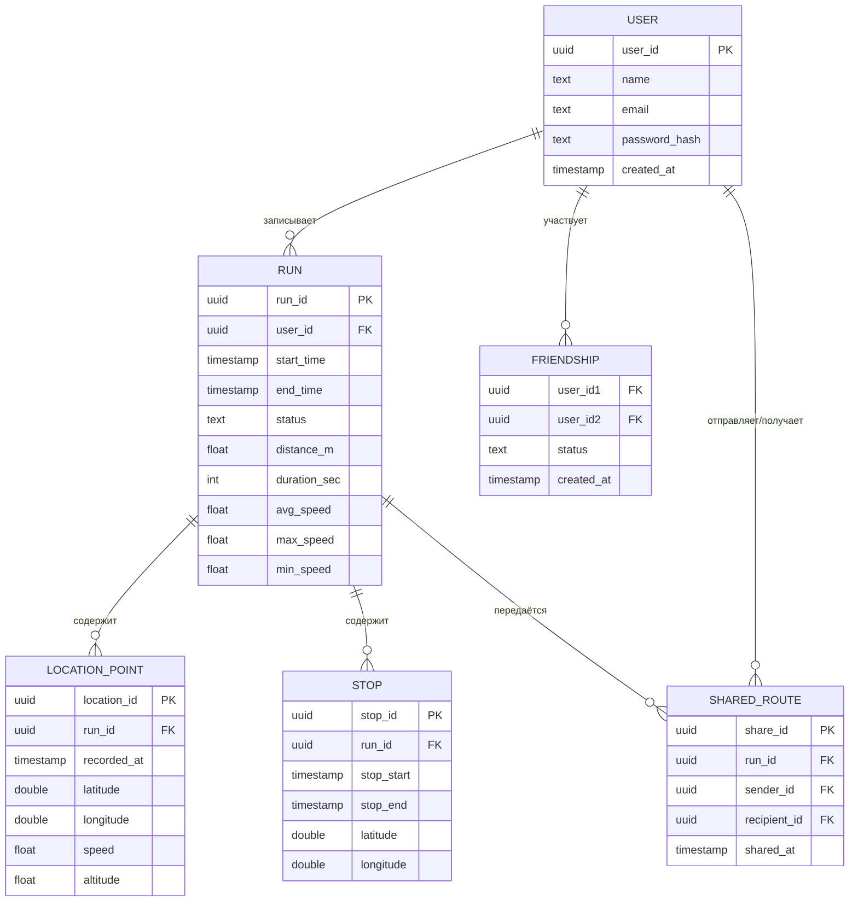

## Концептуальная модель (E/R)

```
User
├── user_id (PK)
├── name
├── email
├── password_hash
└── created_at

Run
├── run_id (PK)
├── user_id (FK → User)
├── start_time
├── end_time
├── status          -- 'in_progress' | 'paused' | 'completed'
├── distance_m      -- итоговое расстояние, метры
├── duration_sec    -- итоговое время в движении
├── avg_speed       -- км/ч
├── max_speed
└── min_speed

LocationPoint
├── location_id (PK)
├── run_id (FK → Run)
├── recorded_at
├── latitude
├── longitude
├── speed
└── altitude

Stop
├── stop_id (PK)
├── run_id (FK → Run)
├── stop_start
├── stop_end
├── latitude
└── longitude

Friendship
├── user_id1 (FK → User)
├── user_id2 (FK → User)
├── status          -- 'pending' | 'accepted'
└── created_at

SharedRoute
├── share_id (PK)
├── run_id (FK → Run)
├── sender_id (FK → User)
├── recipient_id (FK → User)
└── shared_at
```

Связи: User 1:N Run, Run 1:N LocationPoint, Run 1:N Stop, User M:N User (через Friendship), User M:N Run (через SharedRoute).



## Запросы

| ID  | Запрос                                                | Когда                          |
| --- | ----------------------------------------------------- | ------------------------------ |
| Q1  | Авторизация: найти пользователя по email              | Вход                           |
| Q2  | Получить профиль пользователя по user_id              | Главный экран                  |
| Q3  | Создать запись о пробежке (старт)                     | Нажатие «Старт»                |
| Q4  | Записать точку геолокации                             | Каждые N секунд                |
| Q5  | Записать остановку (начало/конец паузы)               | Нажатие «Пауза» / «Продолжить» |
| Q6  | Завершить пробежку (финальные метрики)                | Нажатие «Стоп»                 |
| Q7  | Получить маршрут пробежки (все точки)                 | Просмотр карты                 |
| Q8  | Получить статистику одной пробежки                    | Экран пробежки                 |
| Q9  | Получить историю пробежек пользователя                | Список пробежек                |
| Q10 | Получить статистику за период (день/неделя/месяц/год) | Дашборд                        |
| Q11 | Получить список друзей                                | Экран «Друзья»                 |
| Q12 | Добавить/принять/удалить друга                        | Управление друзьями            |
| Q13 | Поделиться маршрутом с другом                         | Кнопка «Поделиться»            |
| Q14 | Получить входящие маршруты от друзей                  | Лента друзей                   |
| Q15 | Получить глобальный лидерборд за год                  | Экран «Рейтинг»                |
| Q16 | Получить позицию пользователя в лидерборде            | Экран «Рейтинг»                |
| Q17 | Обновить итоговый пробег пользователя за год          | После каждой пробежки          |

Зависимости: старт (Q3) → запись точек (Q4) и пауз (Q5) → финиш (Q6) → обновление статистики (Q17). Просмотр пробежки — Q7+Q8, дашборд — Q9+Q10, социальное — Q11–Q14, лидерборд — Q15+Q16.

## Логическая модель

```
users_by_email          ← Q1 (логин)
users                   ← Q2 (профиль)
runs_by_user            ← Q9 (история пробежек), Q3/Q6
run_details             ← Q8 (детали одной пробежки)
locations_by_run        ← Q7 (маршрут на карту), Q4
stops_by_run            ← Q5 (паузы), Q7
stats_by_user_period    ← Q10 (статистика за период)
user_yearly_stats       ← Q16, Q17 (пробег за год для лидерборда)
friendships             ← Q11, Q12
shared_routes           ← Q13, Q14
leaderboard             ← Q15 (топ за год)
```

## Физическая модель (Cassandra CQL)

```cql
CREATE KEYSPACE running_app
  WITH replication = {
    'class': 'SimpleStrategy',
    'replication_factor': 3
  };

USE running_app;

-- Q1: логин по email
CREATE TABLE users_by_email (
    email        text        PRIMARY KEY,
    user_id      uuid,
    password_hash text,
    name         text
);

-- Q2: профиль по user_id
CREATE TABLE users (
    user_id      uuid        PRIMARY KEY,
    name         text,
    email        text,
    created_at   timestamp
);

-- Q9: история пробежек пользователя (новые — первые)
-- Q3: вставка при старте, Q6: обновление при финише
CREATE TABLE runs_by_user (
    user_id         uuid,
    start_time      timestamp,
    run_id          uuid,
    end_time        timestamp,
    status          text,          -- 'in_progress' | 'paused' | 'completed'
    distance_m      float,
    duration_sec    int,
    avg_speed_kmh   float,
    max_speed_kmh   float,
    min_speed_kmh   float,
    PRIMARY KEY (user_id, start_time, run_id)
) WITH CLUSTERING ORDER BY (start_time DESC, run_id ASC);

-- Q8: детали конкретной пробежки
CREATE TABLE run_details (
    run_id          uuid        PRIMARY KEY,
    user_id         uuid,
    start_time      timestamp,
    end_time        timestamp,
    status          text,
    distance_m      float,
    duration_sec    int,
    avg_speed_kmh   float,
    max_speed_kmh   float,
    min_speed_kmh   float
);

-- Q4: запись точек геолокации
-- Q7: маршрут для карты (хронологический порядок)
CREATE TABLE locations_by_run (
    run_id       uuid,
    recorded_at  timestamp,
    latitude     double,
    longitude    double,
    speed_kmh    float,
    altitude_m   float,
    PRIMARY KEY (run_id, recorded_at)
) WITH CLUSTERING ORDER BY (recorded_at ASC);

-- Q5: паузы в пробежке
CREATE TABLE stops_by_run (
    run_id       uuid,
    stop_start   timestamp,
    stop_end     timestamp,
    latitude     double,
    longitude    double,
    PRIMARY KEY (run_id, stop_start)
) WITH CLUSTERING ORDER BY (stop_start ASC);

-- Q10: статистика пользователя за день/неделю/месяц/год
-- period_type: 'day' | 'week' | 'month' | 'year'
-- period_key:  '2024-03-15' | '2024-W11' | '2024-03' | '2024'
CREATE TABLE stats_by_user_period (
    user_id         uuid,
    period_type     text,
    period_key      text,
    total_distance_m float,
    total_duration_sec int,
    run_count       int,
    avg_speed_kmh   float,
    max_speed_kmh   float,
    PRIMARY KEY ((user_id, period_type), period_key)
) WITH CLUSTERING ORDER BY (period_key DESC);

-- Q16/Q17: суммарный пробег за год (нужен для обновления лидерборда — нужно знать старое значение)
CREATE TABLE user_yearly_stats (
    user_id         uuid,
    year            int,
    total_distance_m float,
    run_count       int,
    user_name       text,
    PRIMARY KEY (user_id, year)
) WITH CLUSTERING ORDER BY (year DESC);

-- Q11: список друзей, Q12: добавить/удалить
CREATE TABLE friendships (
    user_id      uuid,
    friend_id    uuid,
    friend_name  text,
    status       text,          -- 'pending' | 'accepted'
    created_at   timestamp,
    PRIMARY KEY (user_id, friend_id)
);

-- Q13/Q14: маршруты, которыми поделились с пользователем (новые — первые)
CREATE TABLE shared_routes (
    recipient_id  uuid,
    shared_at     timestamp,
    run_id        uuid,
    sender_id     uuid,
    sender_name   text,
    -- денормализованные данные пробежки для превью в ленте
    run_start     timestamp,
    distance_m    float,
    duration_sec  int,
    PRIMARY KEY (recipient_id, shared_at, run_id)
) WITH CLUSTERING ORDER BY (shared_at DESC, run_id ASC);

-- Q15: глобальный топ за год
-- year_bucket = '2024'; при > ~10k пользователей разбить на '2024-A'..'2024-Z'
-- При обновлении: DELETE старую строку + INSERT новую (изменился total_distance_m)
CREATE TABLE leaderboard (
    year_bucket     text,
    total_distance_m float,
    user_id         uuid,
    user_name       text,
    PRIMARY KEY (year_bucket, total_distance_m, user_id)
) WITH CLUSTERING ORDER BY (total_distance_m DESC, user_id ASC);
```
